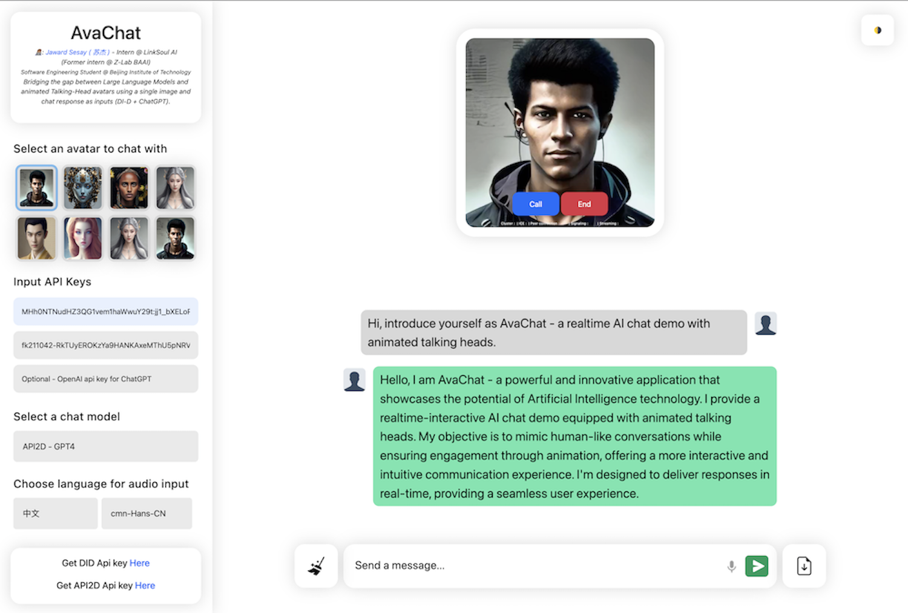

# AvaChat

AvaChat - is a realtime AI chat demo with animated talking heads - it uses Large Language Models (ChatGPT, API2D GPT4, Cluade) as text inputs to D-ID's stable difussion model (via D-ID stream api)

