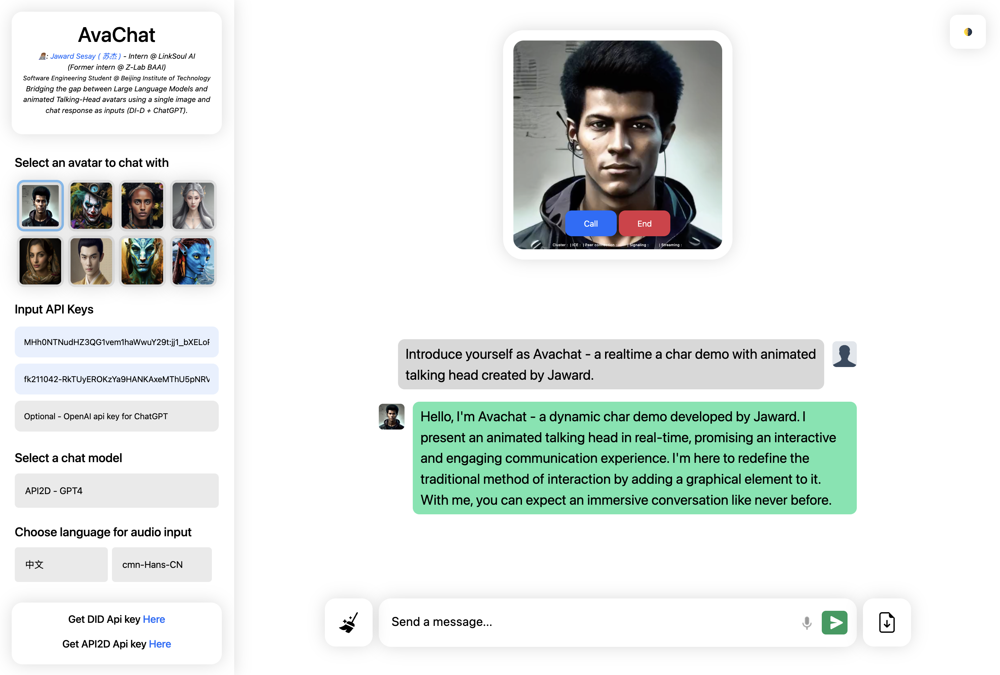

# AvaChat

AvaChat - is a realtime AI chat demo with animated talking heads - it uses Large Language Models (GPT4, Cluade) as text inputs to D-ID's stable difussion video gen model (via D-ID's stream api)



|                                  Full Demo                                                            |
|                                    :---:                                                              |
| <video src="https://github.com/Jaykef/AvaChat/assets/11355002/53aa9884-1e47-412f-a248-e50eed21809b" > |


| Demo 1       | Demo 2         | Demo 3        | Demo 4 |
|    :---:     |     :---:      |      :---:    | :---:  |
| <video src="https://github.com/Jaykef/AvaChat/assets/11355002/718478bf-71d6-4f4c-95c4-3ce445ce3fab">  | <video src="https://github.com/Jaykef/AvaChat/assets/11355002/27218bd1-ea69-4968-8c03-1e2dd69736f7" >  | <video src="https://github.com/Jaykef/AvaChat/assets/11355002/8a213e87-8084-449a-b89b-b94ac72c3600" >    | <video src="https://github.com/Jaykef/AvaChat/assets/11355002/cc53247c-fbb9-421c-b97b-0c1badcbfe01" > |


## Installation
1. Clone repo
   
   ```
   git clone https://github.com/Jaykef/AvaChat.git
   ``` 
3. Install node modules in root directory
   
    ```
   npm install
    ```
5. Run app
   
   ```
    npm start
   ```
   Try app at http://localhost:8000/
7. Input D-ID api key for video stream
   
   Get your own api key here <a href="https://studio.d-id.com/account-settings/" target="_blank">Here</a>
9. Text generation Api keys

   You can use either openAI api key or API2D api key for text generation:
   Get API2D api key <a href="https://api2d.com/" target="_blank">Here</a>


## License

MIT License
